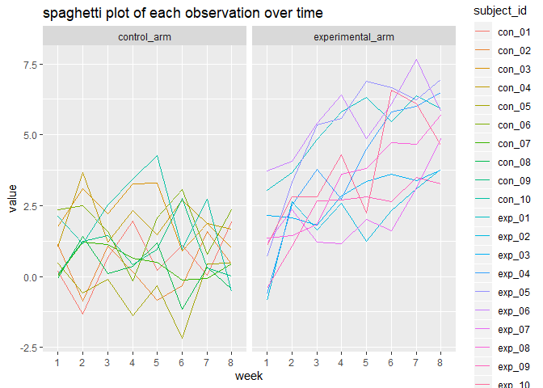
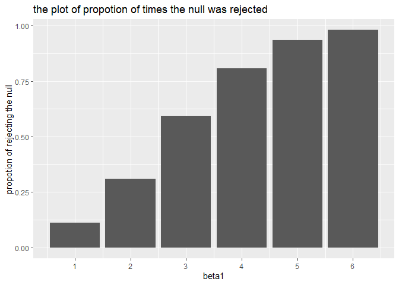
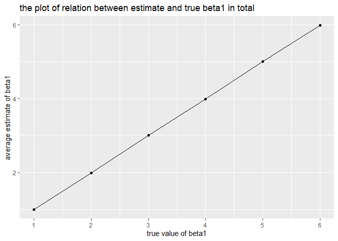
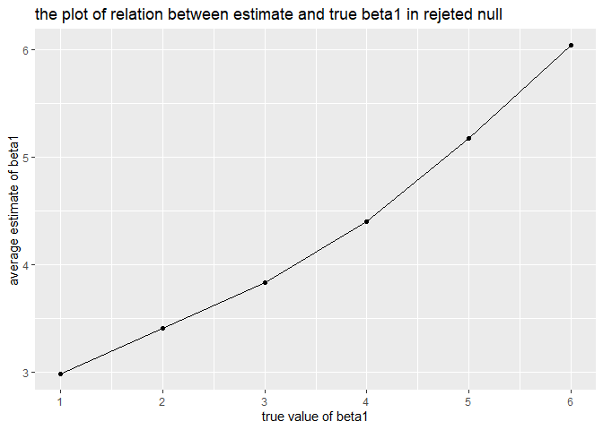
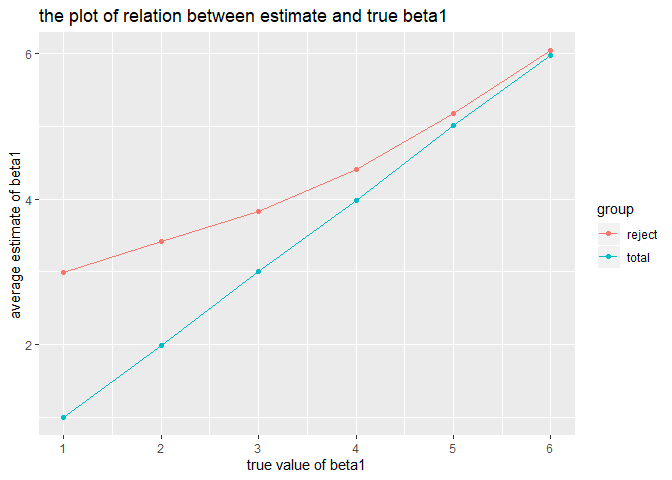

hw5
================
YuaoYang
2019/11/10

# Problem 1

``` r
library(tidyverse)
```

    ## -- Attaching packages --------------------------------------- tidyverse 1.2.1 --

    ## √ ggplot2 3.2.1     √ purrr   0.3.2
    ## √ tibble  2.1.3     √ dplyr   0.8.3
    ## √ tidyr   1.0.0     √ stringr 1.4.0
    ## √ readr   1.3.1     √ forcats 0.4.0

    ## -- Conflicts ------------------------------------------ tidyverse_conflicts() --
    ## x dplyr::filter() masks stats::filter()
    ## x dplyr::lag()    masks stats::lag()

``` r
set.seed(10)

iris_with_missing = iris %>% 
  map_df(~replace(.x, sample(1:150, 20), NA)) %>%
  mutate(Species = as.character(Species))
```

``` r
fill_miss = function(x) {
  if(is.numeric(x)){
    x = replace_na(x, round(mean(x, na.rm = TRUE),2))
  }else if(is.character(x)){
    x = replace_na(x, "virginica")
  }
}

new_iris = map(iris_with_missing, fill_miss) %>%
  data.frame()
```

# Problem 2

``` r
file_name = list.files(path = "./data/",full.names = TRUE) 
 
read_data = purrr::map(file_name, read.csv) %>%
  bind_rows() %>%
  mutate(subject_id = str_sub(file_name,8,13),
         arm = ifelse(str_detect(subject_id, "con"),"control_arm", "experimental_arm")) %>%
  select(subject_id, arm, week_1:week_8) %>%
  pivot_longer(cols = 3:10, names_to = "week",names_prefix = "week_",values_to = "value") %>%
  mutate(arm = factor(arm, levels = c("control_arm", "experimental_arm")))
```

``` r
read_data %>%
  group_by(week) %>%
ggplot(aes(x = week, y = value, group = subject_id, color = subject_id))+
  geom_line() + labs(title = "spaghetti plot of each observation over time") +
   facet_grid(. ~ arm)
```

<!-- --> From the plot, i
find the abservational value in experimental arm group are bigger than
it in control arm group in overall trend.

# Problem 3

``` r
set.seed(2)
sim_regression = function(n = 30, beta0 = 2, beta1, variance = 50) {

   sim_data = tibble(

    x = rnorm(n),

    y = beta0 + beta1 * x + rnorm(n, 0,  sqrt (variance)))

  ls_fit = broom::tidy (lm(y ~ x, data = sim_data))
}

# i try to use beta1 = 0 to check the null hypothesis
result_1  = rerun(10000, sim_regression(beta1 = 0)) %>% 
  bind_rows() %>% 
  filter(term == "x") %>%
  select(estimate, p.value)
# i try to use beta1 = 1:6 to try the linear funciton
result_2  = 
  tibble(beta1 = 1:6) %>% 
  mutate(beta1_new = map(.x = beta1, ~rerun(10000,sim_regression(beta1 =.x)))) %>% 
  unnest()
```

    ## Warning: `cols` is now required.
    ## Please use `cols = c(beta1_new)`

``` r
sim_result = result_2 %>%
  unnest()
```

    ## Warning: `cols` is now required.
    ## Please use `cols = c(beta1_new)`

``` r
sim_result %>%
 filter(term == "x") %>%
  select(beta1, estimate, p.value) %>%
  filter(p.value< 0.05) %>%
  group_by(beta1) %>%
  summarize(propotion = n()/10000)%>%
  ggplot(aes(x= beta1, y = propotion)) + geom_histogram(stat = "identity")+
   scale_x_continuous(
    breaks = c(1,2,3,4,5,6)) +
  labs(y = "propotion of rejecting the null",
       title ="the plot of propotion of times the null was rejected")
```

    ## Warning: Ignoring unknown parameters: binwidth, bins, pad

<!-- --> From the plot,
we can easily find that when beta1 increases, the reject propotion will
increase, which means that there is positive relation between effect
size and power.

``` r
total = sim_result %>%
 filter(term == "x") %>%
  select(beta1, estimate, p.value) %>%
  group_by(beta1) %>%
  summarize(mean_beta1 = mean(estimate)) %>%
  mutate(group = "total")
  
ggplot(total, aes(x= beta1, y = mean_beta1)) + geom_point()+ geom_line()+
   scale_x_continuous(
    breaks = c(1,2,3,4,5,6)) + labs(y = "average estimate of beta1",
                                    x = "true value of beta1",
       title ="the plot of relation between estimate and true beta1 in total")
```

<!-- -->

``` r
reject_null = sim_result %>%
 filter(term == "x") %>%
  select(beta1, estimate, p.value) %>%
  filter(p.value< 0.05) %>%
  group_by(beta1) %>%
  summarize(mean_beta1 = mean(estimate)) %>%
  mutate(group = "reject")

ggplot(reject_null, aes(x= beta1, y = mean_beta1)) + geom_point()+geom_line() +
   scale_x_continuous(
    breaks = c(1,2,3,4,5,6)) +
  labs(y = "average estimate of beta1",
        x = "true value of beta1",
       title ="the plot of relation between estimate and true beta1 in rejeted null")
```

<!-- -->

``` r
rbind(reject_null,total) %>%
   ggplot(aes(x= beta1, y = mean_beta1, color= group)) + geom_point()+geom_line() +
   scale_x_continuous(
    breaks = c(1,2,3,4,5,6)) +
  labs(y = "average estimate of beta1",
        x = "true value of beta1",
       title ="the plot of relation between estimate and true beta1")
```

<!-- -->

From the plot, we can find that the sample average of beta1 is not equal
to true value of beta1. And the with the effect size increases, the
average value will closer to true value. To explain it, we need to
return the last propotion plot, according to what I said before, the
power is very low when effect size is small, which means there are fewer
estimate of beta1 in low effect size and the sample size of estimate is
too small to get the accurate average value.
